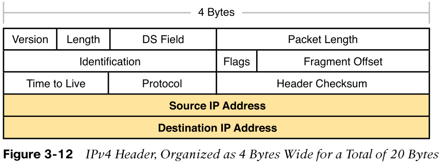

# IPv4

[Internet Protocol](untitled-15.md) Version 4 is 4 Bytes 32 bits Decimal Address which can produce over 4 Billion \(4,294,967,296\) Unique Addresses.

* This 32-bit IPv4 Address is made up of 4 Sets & each Set includes 8 binary bits separated by a dot called Octets.
* Those bits in each Octet are represented by a number.  Starting from the left they have a value of 128, 64, 32, 16, 8, 4, 2, 1.
* Each bit on the octet can be either 1 or 0. If a Number is 1 then that octet is counted if it is a 0 then it is ignored.
* Just by manipulating 1s & 0s in each octet, we get a range from 0-255.
* **IPv4 Header:**

## Reference:

* [https://www.youtube.com/watch?v=ThdO9beHhpA&ab\_channel=PowerCertAnimatedVideos](https://www.youtube.com/watch?v=ThdO9beHhpA&ab_channel=PowerCertAnimatedVideos)
* CCNA 200-301 OCG, Volume 1, Pg. 74 - Wendell Odom . 

